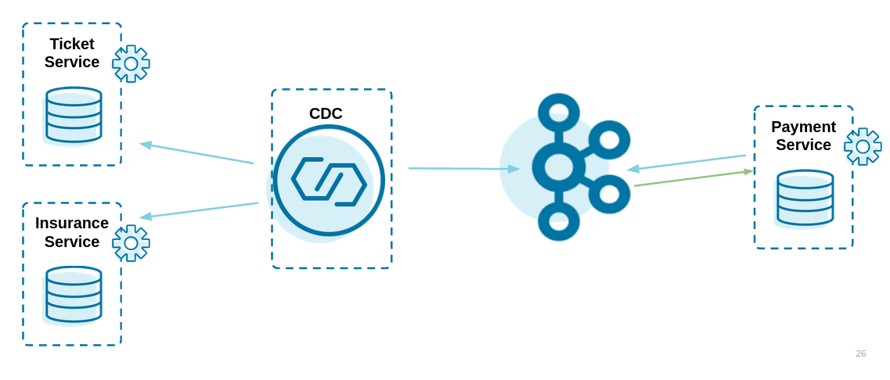
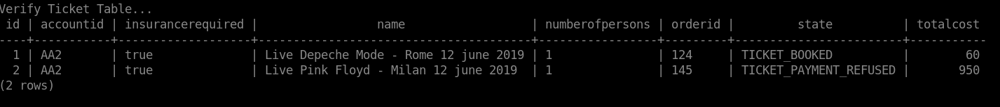

Saga Choreography with Confluent, Debezium
=============================

### Architecture




### Launch on your local environment in quarkus dev mode

Launch Docker Postgres and create the databases:

```bash
docker run -d --name postgres -e POSTGRES_PASSWORD=password -p 5432:5432 debezium/postgres
docker exec -it postgres psql -h localhost -p 5432 -U postgres -c 'CREATE DATABASE tickets;'
docker exec -it postgres psql -h localhost -p 5432 -U postgres -c 'CREATE DATABASE payments;'
docker exec -it postgres psql -h localhost -p 5432 -U postgres -c 'CREATE DATABASE insurances;'
```

Launch Docker Zookeeper and Docker Kafka:

```bash
docker run -d --name zookeeper -p 2181:2181 -p 2888:2888 -p 3888:3888 confluentinc/cp-zookeeper:6.1.0
docker run -d --name my-cluster-kafka-bootstrap -p 9092:9092 --link zookeeper:zookeeper confluentinc/cp-enterprise-kafka:6.1.0
```

Create a debezium outbox-connect image:

```bash
cd debezium/
mvn compile package
docker build -t outbox-connect:latest .
```

Run Docker debezium outbox-connect and install the connectors:

```bash
docker run -d --name connect -p 8083:8083 -e BOOTSTRAP_SERVERS=my-cluster-kafka-bootstrap:9092 -e GROUP_ID=1 -e CONNECT_KEY_CONVERTER_SCHEMAS_ENABLE=false -e CONNECT_VALUE_CONVERTER_SCHEMAS_ENABLE=false -e CONFIG_STORAGE_TOPIC=my-connect-configs -e OFFSET_STORAGE_TOPIC=my-connect-offsets -e ADVERTISED_HOST_NAME=${DOCKER_HOST} --link zookeeper:zookeeper --link postgres:postgres --link my-cluster-kafka-bootstrap:my-cluster-kafka-bootstrap outbox-connect
curl -X POST -H "Accept:application/json" -H "Content-Type:application/json" localhost:8083/connectors/ -d @connector/ticket-connector.json
curl -X POST -H "Accept:application/json" -H "Content-Type:application/json" localhost:8083/connectors/ -d @connector/order-connector.json
curl -X POST -H "Accept:application/json" -H "Content-Type:application/json" localhost:8083/connectors/ -d @connector/payment-connector.json
```

Run ticket service in quarkus dev mode: (debug port 5005, http port 8080)

```bash
cd ticket/
./mvnw compile quarkus:dev -Dkafka.bootstrap.servers=localhost:9092
```

Run insurance service in quarkus dev mode: (debug port 5006, http port 8090)

```bash
cd insurance/
./mvnw compile quarkus:dev -Dquarkus.http.port=8090 -Ddebug=5006 -Dkafka.bootstrap.servers=localhost:9092
```

Run payment service in quarkus dev mode: (debug port 5007, http port 8100)

```bash
cd payment/
./mvnw compile quarkus:dev -Dquarkus.http.port=8100 -Ddebug=5007 -Dkafka.bootstrap.servers=localhost:9092
```

 Run a simulation:

```bash
cd simulation/
./test-devmode-saga.sh
./test-devmode-saga-failed.sh
```


### Launch on Docker
Launch the bootstrap script to create the docker containers.<br>
Images are downloaded from docker hub and from quay.io.

Images:
 - Postgres on local port 5432
 - Elastic Search + Kibana on local port 9200 (es) and 5601 (kibana)
 - Zookeeper on local port 2181
 - Kafka on local port 9092
 - Kafka Connect + Debezium on local port 8083
 - Ticket Service on local port 8080
 - Insurance Service on local port 8090
 - Payment Service on local port 8100

```bash
cd choreography/
./deploy-docker.sh
```

Run a simulation:

```bash
cd simulation/
./test-saga.sh
./test-saga-failed.sh
```

2 tickets will be created.

2 insurances will be created.

### Verification

This is the final state inside the microservices databases at the end of the 2 sagas:





Events as stored in Elastic Search (Kibana view):


