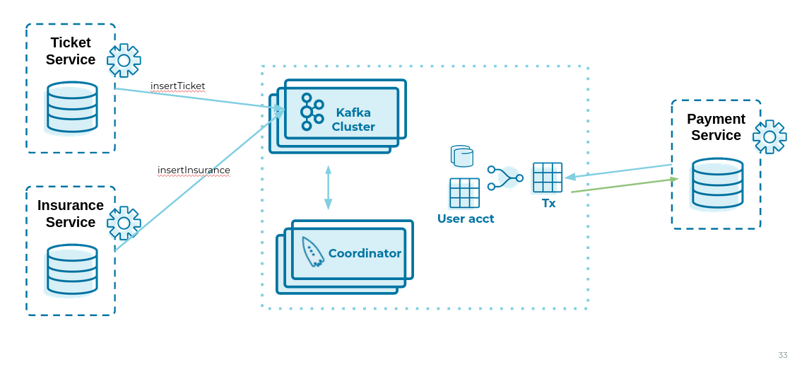
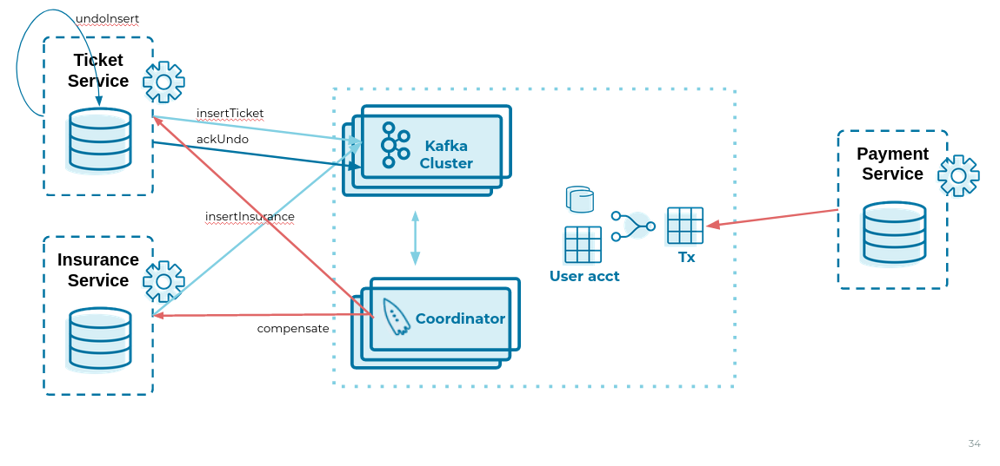

Saga Coordinator with ksqlDB
=============================

### Architecture






### Compile

```bash
mvn schema-registry:download
mvn generate-sources
mvn clean compile
```

### Launch on local environment

Launch Docker Compose:

```bash
docker-compose up
```

Connect to ksqlDB and set auto.offset.reset:

```bash
ksql http://ksqldb-server:8088
SET 'auto.offset.reset' = 'earliest';
```

Create DDL on ksqlDB:

```bash
./ksql/ksql-statements.sh
```

Insert entries on ksqlDB:

```bash
./ksql/ksql-insert.sh
```

Create fat jar of Sample application (1 Saga):

```bash
mvn clean compile assembly:single
```

Execute fat jar of Sample application (1 Saga):

```bash
java -jar payment-0.0.1-jar-with-dependencies.jar
```

### Verification

```sql
insert into accounts values('AAA', 'Jimmy Best');
insert into orders values('AAA', 150, 'Item0', 'A123', 'Jimmy Best', 'Transfer funds', '2020-04-22 03:19:51');
insert into orders values('AAA', -110, 'Item1', 'A123', 'amazon.it', 'Purchase', '2020-04-22 03:19:55');
insert into orders values('AAA', -100, 'Item2', 'A123', 'ebike.com', 'Purchase', '2020-04-22 03:19:58');

select * from orders_tx where account_id='AAA' and order_id='A123';
```

```java
Order Action:{"TX_ID": "TX_AAA_A123", "TX_ACTION": 0, "ACCOUNT": "AAA", "ITEMS": ["Item0"], "ORDER": "A123"}
Order Action:{"TX_ID": "TX_AAA_A123", "TX_ACTION": 0, "ACCOUNT": "AAA", "ITEMS": ["Item0", "Item1"], "ORDER": "A123"}
Order Action:{"TX_ID": "TX_AAA_A123", "TX_ACTION": -1, "ACCOUNT": "AAA", "ITEMS": ["Item0", "Item1", "Item2"], "ORDER": "A123"}
 --> compensate:{"TX_ID": "TX_AAA_A123", "TX_ACTION": -1, "ACCOUNT": "AAA", "ITEMS": ["Item0", "Item1", "Item2", "ORDER": "A123"}
```
