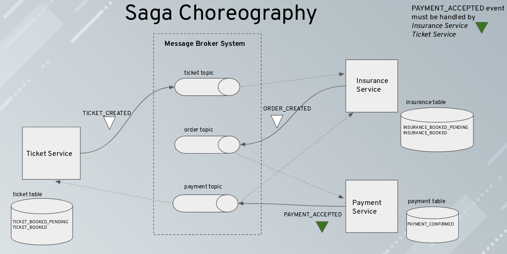
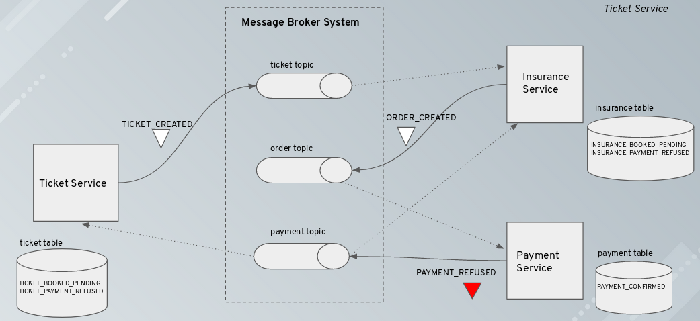
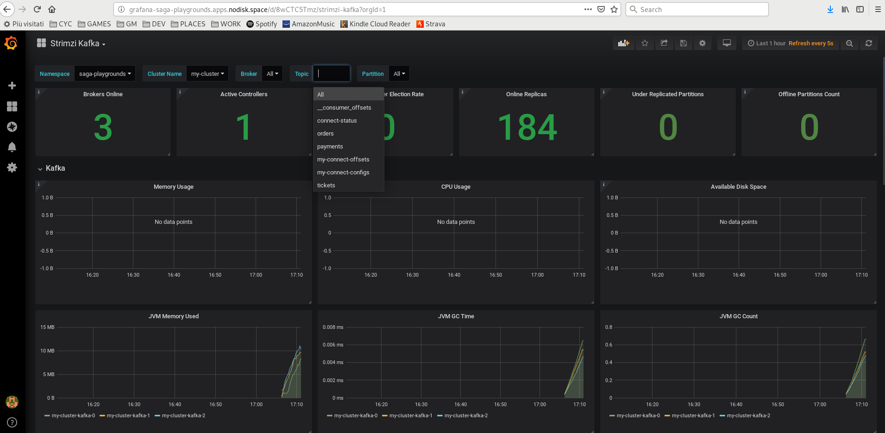
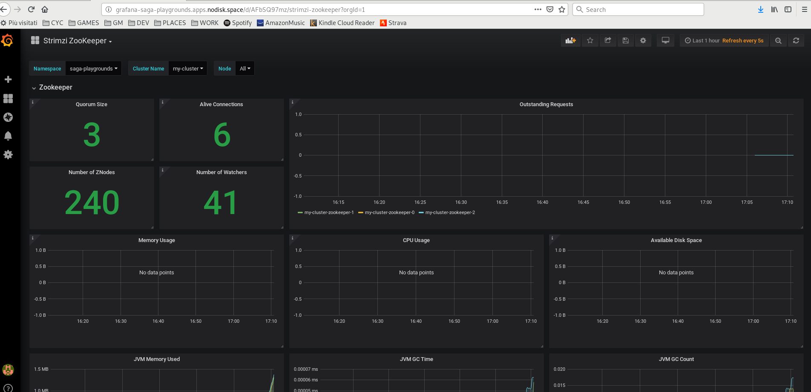
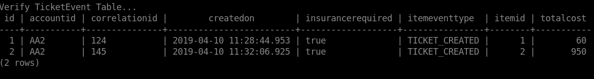
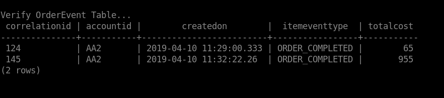
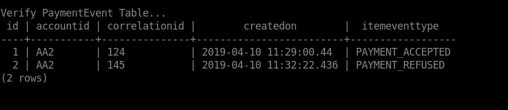
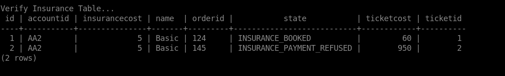
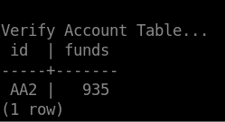
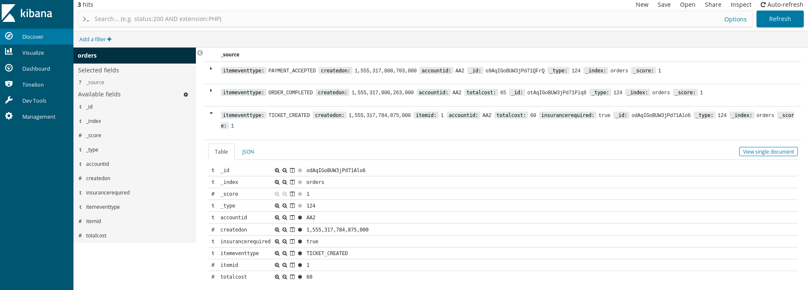

Saga Choreography with Kafka, Debezium and Quarkus
=============================

### Architecture





### Launch on your local environment in quarkus dev mode

Launch Docker Postgres and create the databases:

```bash
docker run -d --name postgres -e POSTGRES_PASSWORD=password -p 5432:5432 debezium/postgres
docker exec -it postgres psql -h localhost -p 5432 -U postgres -c 'CREATE DATABASE tickets;'
docker exec -it postgres psql -h localhost -p 5432 -U postgres -c 'CREATE DATABASE payments;'
docker exec -it postgres psql -h localhost -p 5432 -U postgres -c 'CREATE DATABASE insurances;'
```

Launch Docker Zookeeper and Docker Kafka:

```bash
docker run -d --name zookeeper -p 2181:2181 -p 2888:2888 -p 3888:3888 debezium/zookeeper
docker run -d --name my-cluster-kafka-bootstrap -p 9092:9092 --link zookeeper:zookeeper debezium/kafka
```

Create a debezium outbox-connect image:

```bash
cd debezium/
mvn compile package
docker build -t outbox-connect:latest .
```

Run Docker debezium outbox-connect and install the connectors:

```bash
docker run -d --name connect -p 8083:8083 -e BOOTSTRAP_SERVERS=my-cluster-kafka-bootstrap:9092 -e GROUP_ID=1 -e CONNECT_KEY_CONVERTER_SCHEMAS_ENABLE=false -e CONNECT_VALUE_CONVERTER_SCHEMAS_ENABLE=false -e CONFIG_STORAGE_TOPIC=my-connect-configs -e OFFSET_STORAGE_TOPIC=my-connect-offsets -e ADVERTISED_HOST_NAME=${DOCKER_HOST} --link zookeeper:zookeeper --link postgres:postgres --link my-cluster-kafka-bootstrap:my-cluster-kafka-bootstrap outbox-connect
curl -X POST -H "Accept:application/json" -H "Content-Type:application/json" localhost:8083/connectors/ -d @connector/ticket-connector.json
curl -X POST -H "Accept:application/json" -H "Content-Type:application/json" localhost:8083/connectors/ -d @connector/order-connector.json
curl -X POST -H "Accept:application/json" -H "Content-Type:application/json" localhost:8083/connectors/ -d @connector/payment-connector.json
```

Run ticket service in quarkus dev mode: (debug port 5005, http port 8080)

```bash
cd ticket/
./mvnw compile quarkus:dev -Dkafka.bootstrap.servers=localhost:9092
```

Run insurance service in quarkus dev mode: (debug port 5006, http port 8090)

```bash
cd insurance/
./mvnw compile quarkus:dev -Dquarkus.http.port=8090 -Ddebug=5006 -Dkafka.bootstrap.servers=localhost:9092
```

Run payment service in quarkus dev mode: (debug port 5007, http port 8100)

```bash
cd payment/
./mvnw compile quarkus:dev -Dquarkus.http.port=8100 -Ddebug=5007 -Dkafka.bootstrap.servers=localhost:9092
```

 Run a simulation:

```bash
cd simulation/
./test-devmode-saga.sh
./test-devmode-saga-failed.sh
```


### Launch on OpenShift

Images can be downloaded from docker hub and from https://quay.io

Images:
 - Postgres (image debezium/postgres) on port 5432
 - AMQ Streams (Zookeeper on port 2181 and Kafka on port 9092)
 - Kafka Connect + Debezium (image quay.io/bridlos/outbox-connect) on port 8083
 - Ticket Service (image quay.io/bridlos/ticket-service-quarkus) on port 8080
 - Insurance Service (image quay.io/bridlos/insurance-service-quarkus) on port 8080
 - Payment Service (image quay.io/bridlos/payment-service-quarkus) on port 8080

 Elastic Search and Kibana are not installed in Openshift (available only for local installation).

 Run a simulation:

```bash
cd simulation/
./test-ocp-saga.sh
./test-ocp-saga-failed.sh
```

Watch a video of a simulation at (set video quality to 1080):<br>
https://www.youtube.com/watch?v=7cLbRIc3TWU
[](https://www.youtube.com/watch?v=7cLbRIc3TWU)

In order to create the demo on your openshift environment, you need:
 - ocp user with cluster-admin role
 - oc client installed on your machine
 - AMQ Streams 1.x for ocp downloaded from Red Hat<br>
 https://access.redhat.com/jbossnetwork/restricted/listSoftware.html?downloadType=distributions&product=jboss.amq.streams

Follow these instructions to create the demo:

Login to ocp, create a new project, create e new service account runasanyuid (postgres must run as root):
```bash
oc login <ocp_master_url> --token=<ocp_user_token>
oc new-project saga-playgrounds
oc create serviceaccount runasanyuid
oc adm policy add-scc-to-user anyuid -z runasanyuid -n saga-playgrounds
```

Create postgres, then create tickets, insurances and payments database:
```bash
oc new-app debezium/postgres
oc patch dc/postgres --patch '{"spec":{"template":{"spec":{"serviceAccountName": "runasanyuid"}}}}'


oc exec $(oc get pods | grep postgres | cut -d " " -f1) -- bash -c 'psql -h localhost -p 5432 -U postgres -c "CREATE DATABASE tickets;"'
oc exec $(oc get pods | grep postgres | cut -d " " -f1) -- bash -c 'psql -h localhost -p 5432 -U postgres -c "CREATE DATABASE payments;"'
oc exec $(oc get pods | grep postgres | cut -d " " -f1) -- bash -c 'psql -h localhost -p 5432 -U postgres -c "CREATE DATABASE insurances;"'
```

Install AMQ Streams cluster operator and a kafka cluster with 3 brokers (ephemeral and with prometheus metrics).<br>
This step requires that you've downloaded and unpacked the AMQ Streams zip archive for ocp <br>
(for more info about the installation, https://access.redhat.com/documentation/en-us/red_hat_amq/7.2/html-single/using_amq_streams_on_openshift_container_platform/index)


```bash
#replace the template namespace with saga-playgrounds
sed -i 's/namespace: .*/namespace: saga-playgrounds/' install/cluster-operator/*RoleBinding*.yaml
oc apply -f install/cluster-operator/020-RoleBinding-strimzi-cluster-operator.yaml -n saga-playgrounds
oc apply -f install/cluster-operator/031-RoleBinding-strimzi-cluster-operator-entity-operator-delegation.yaml -n saga-playgrounds
oc apply -f install/cluster-operator/032-RoleBinding-strimzi-cluster-operator-topic-operator-delegation.yaml -n saga-playgrounds
oc apply -f install/cluster-operator -n saga-playgrounds
oc apply -f examples/metrics/kafka-metrics.yaml
```

Create the outbox-connect application:
```bash
oc new-app quay.io/bridlos/outbox-connect -e ES_DISABLED=true -e BOOTSTRAP_SERVERS=my-cluster-kafka-bootstrap:9092 -e GROUP_ID=1 -e CONNECT_KEY_CONVERTER_SCHEMAS_ENABLE=false -e CONNECT_VALUE_CONVERTER_SCHEMAS_ENABLE=false -e CONFIG_STORAGE_TOPIC=my-connect-configs -e OFFSET_STORAGE_TOPIC=my-connect-offsets
oc expose svc/outbox-connect
```

Install the debezium connectors:
```bash
cd debezium/connector/

curl -X POST -H "Accept:application/json" -H "Content-Type:application/json" http://<outbox-connect-url>/connectors/ -d @ticket-connector.json
curl -X POST -H "Accept:application/json" -H "Content-Type:application/json" http://<outbox-connect-url>/connectors/ -d @order-connector.json
curl -X POST -H "Accept:application/json" -H "Content-Type:application/json" http://<outbox-connect-url>/connectors/ -d @payment-connector.json
```

Install ticket, insurance and payment microservice:
```bash
oc new-app quay.io/bridlos/ticket-service-quarkus
oc expose svc/ticket-service-quarkus
oc new-app quay.io/bridlos/insurance-service-quarkus
oc expose svc/insurance-service-quarkus
oc new-app quay.io/bridlos/payment-service-quarkus
```

Install prometheus and grafana:
```bash
wget https://raw.githubusercontent.com/strimzi/strimzi-kafka-operator/0.10.0/metrics/examples/prometheus/kubernetes.yaml
mv kubernetes.yaml prometheus.yaml
oc apply -f prometheus.yaml -n saga-playgrounds
oc adm policy add-cluster-role-to-user prometheus -z prometheus-server
wget https://raw.githubusercontent.com/strimzi/strimzi-kafka-operator/0.10.0/metrics/examples/grafana/kubernetes.yaml
mv kubernetes.yaml grafana.yaml
oc apply -f grafana.yaml -n saga-playgrounds
oc expose svc/grafana
```

Download and import grafana dashboard for kafka and zookeeper, dashboard can be downloaded at:<br>
wget https://raw.githubusercontent.com/strimzi/strimzi-kafka-operator/master/metrics/examples/grafana/strimzi-kafka.json<br>
wget https://raw.githubusercontent.com/strimzi/strimzi-kafka-operator/master/metrics/examples/grafana/strimzi-zookeeper.json

Follow the instruction to import the kafka and zookeeper grafana dashboards:<br>
https://strimzi.io/docs/latest/#grafana_dashboard

Grafana dashboards:






### Launch on local Docker - linux and mac

Launch the bootstrap script to create the docker containers.<br>
Images are downloaded from docker hub and from quay.io.

Images:
 - Postgres (image debezium/postgres) on local port 5432
 - Elastic Search + Kibana (image nshou/elasticsearch-kibana) on local port 9200 and 5601 (kibana)
 - Zookeeper (image debezium/zookeeper) on local port 2181
 - Kafka (image debezium/kafka) on local port 9092
 - Kafka Connect + Debezium (image quay.io/bridlos/outbox-connect) on local port 8083
 - Ticket Service (image quay.io/bridlos/ticket-service-quarkus) on local port 8080
 - Insurance Service (image quay.io/bridlos/insurance-service-quarkus) on local port 8090
 - Payment Service (image quay.io/bridlos/payment-service-quarkus) on local port 8100

```bash
cd choreography/
./deploy-docker.sh
```

Run a simulation:

```bash
cd simulation/
./test-saga.sh
./test-saga-failed.sh
```

2 tickets will be created.

2 insurances will be created.

### Verification

This is the final state inside the microservices databases at the end of the 2 sagas:












Events as stored in Elastic Search (No Openshift) (Kibana view):


